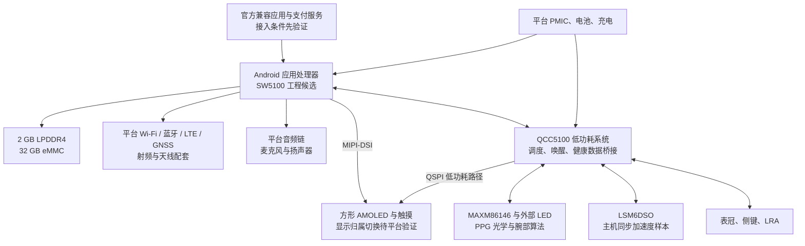

# 自研智能手表：方案重新评估 v0.3

评估日期：2026-09-11。目标：从零自研电子硬件与外壳，操作体验尽量接近 Apple Watch，并保留联网、官方微信/支付宝及真实心率血氧能力。

## 1. 结论与本版决策

**推荐以“能够交付官方应用接入与可定制系统的穿戴参考设计”为主线。具体工程候选优先评估 W5+ / SW5100，W377E 作为方案厂询价备选。SF58 不再是当前完整整机方案的唯一主控。**

目前没有一个已经核实可供本个人项目直接采购、并保证官方微信与支付宝全部可用的组合。W5+ 能运行 Android，并不等于购买其开发套件就获得了这些应用和支付能力。因此本版给出的是有明确验证顺序的选型方案，不是“所有功能已打通”的承诺，也不是可投产 BOM。

完整目标保持不变。阶段样机用于减少返工，不把网络、应用或健康测量删成 UI 演示。旧 v0.1/v0.2 仅保留历史参考，不能继续作为本目标的采购依据。

工作假设：首轮 1–5 台工程样机、主要在中国大陆使用、外观尺度约 46 mm。手机型号、预算和数量尚未指定，本版分别保留 iPhone 与 Android 兼容验收项，不据此停止评估。

## 2. 苹果参照与可实现边界

Series 11 的 46 mm 版本采用 416×496、LTPO3 OLED 屏幕。它可以作为像素密度、暗色界面、交互与尺寸的产品参照；本项目屏幕、续航和健康算法需独立验证。苹果官方公开规格不能证明其内部使用哪一种显示总线。[Apple Watch Series 11 技术规格](https://support.apple.com/en-la/125093)

自研界面、表冠、触觉、联网、真实传感器采样都存在可实施路径。官方微信、支付宝、地图、在线音乐等必须按具体应用和设备服务验证。原版 watchOS、Apple Watch App 原生配对、Apple Pay 等专有生态不作为本方案可交付能力。[Apple Developer Program 协议](https://developer.apple.com/support/terms/apple-developer-program-license-agreement/)

**不要用“支持微信”一个宣传词作为验收条件。**例如 OPPO 的公开说明包含独立微信及特定系统版本条件，而 vivo WATCH 2 的说明要求 Android 手机并保持蓝牙连接。两者使用条件不同，也不能推导到我们的自研硬件。[OPPO Watch X 功能与脚注](https://www.oppo.com/cn/accessories/oppo-watch-x/)，[vivo WATCH 2 功能说明](https://www.vivo.com.cn/vivo/vivowatch2/)

## 3. 平台比较

| 路线 | 当前决策 | 最关键的缺口 |
| --- | --- | --- |
| 方案厂穿戴参考设计 | 优先落地方向；尚不能冻结采购 | 当前尚未找到对本项目已承诺交付的方案厂或正式报价。 |
| TurboX W5+ / SW5100 | 首选具体工程候选 | 官方应用接入未证明；公开套件软件文案版本较旧；关键资料有私有部分。 |
| UNISOC W377E | 并行询价备选；不因品牌推断低价 | 没有核实小批量套件和资料交付；公开 Android 文案不能作为当前应用兼容证明。 |
| SF32LB58x 单主控 | 退出当前完整整机主线 | 没有已核实的官方微信完整应用及支付接入组合；不能直接运行 Android/watchOS 安装包。 |

W5+ 的价值是已有具体开发平台和双系统架构，不在于它是最新芯片。W377E 也有穿戴平台官方资料，但公开页面的软件描述存在版本/型号文案混用，不能把旧 Android 说明当作今天的微信、支付宝兼容性依据。[Qualcomm W5/W5+ Gen 1 产品简报](https://www.qualcomm.com/content/dam/qcomm-martech/dm-assets/documents/Snapdragon-W5-Plus-Gen-1-Wearable-Platforms-product-brief.pdf)，[UNISOC W377E 产品页](https://www.unisoc.com/en/product/SmartWearablesUS/W377E)

SF58 可继续用于已有的表冠、LRA 或传感器台架。其公开 SDK 属于 RT-Thread 路线，不能直接运行 Android/watchOS 安装包。商业 MCU 手表可能通过厂商定制接入应用，但我们尚未取得 SF58 满足本目标的可验证组合。[SiFli SDK](https://github.com/OpenSiFli/SiFli-SDK)

## 4. 建议架构

图中的显示路径表示功能分工，不是可直接照画的电气连接。总线归属、复位、显示内容衔接和电源顺序必须采用供应商验证过的方案，不能把两个主机直接并接。

W5+ 主处理器支持 MIPI-DSI，QCC5100 支持 QSPI DDR；官方简报给出 640×640@60 Hz 的平台显示能力。这不代表任何面板、任何 Android 动画都能达到该性能。[Qualcomm W5/W5+ Gen 1 产品简报](https://www.qualcomm.com/content/dam/qcomm-martech/dm-assets/documents/Snapdragon-W5-Plus-Gen-1-Wearable-Platforms-product-brief.pdf)

首轮软件采用供应商当前可交付的 Android BSP，界面在 Launcher/SystemUI/自研应用层开发；低功耗部分沿用平台框架。现有网页原型可作为视觉规范，LVGL 原型的图形布局与素材可迁移，但源码不能直接替代 Android 界面实现。AOSP、Wear OS 与 Google Play/GMS 不是同一套交付内容。[Google Mobile Services](https://www.android.com/gms/)

## 5. 屏幕与结构

先使用开发套件配套屏验证软件。最终优先选供应商已验证的方形 AMOLED，尤其确认 AOD 与双系统切换。奥视特 ET020AM03-HT 可作为小屏候选：厂商列出 410×502、MIPI 31 pin、800 nit 和 33.07×41.05 mm 外观尺寸；正式接口电压、lane 数、初始化、低功耗刷新、触摸协议、盖板/FPC 总成尺寸、样品供货仍需取得。它尚不是已确认可用于 W5+ 双系统的屏幕。[奥视特 ET020AM03-HT](https://www.aoshite.net/productView1_1975.html)

屏幕规格中的 LTPS 不能等同 Apple 的 LTPO3。不要通过接口或分辨率推断常亮功耗、可视角度或户外观感。最终尺寸必须以屏、主板、500 mAh 级电池候选、天线、光学窗和声腔的 3D 堆叠结果确定；本版不强行承诺 46 mm 外观下的具体厚度。

## 6. 心率、血氧与其他健康功能

主候选调整为 **MAXM86146CFU+ + 外部红/红外/绿光 LED + LSM6DSO**。MAXM86146 集成光学 AFE、算法 MCU 与两个光电二极管，可减少分立集成工作；LED、运动样本、固件与光学结构仍然必需。其算法支持腕式 HR/SpO2，实际准确性要由整机验证决定。[ADI MAXM86146](https://www.analog.com/en/products/maxm86146.html)

首轮健康验证候选为 MAXM86146EVSYS。参考电路含 SFH 7015、两颗 CT DBLP31.12 绿光 LED 和 LED 切换器件。先取得 GUI/固件并记录原始 PPG、加速度、算法输出与质量标志，再设计自有传感板。[ADI MAXM86146EVSYS](https://www.analog.com/en/resources/evaluation-hardware-and-software/evaluation-boards-kits/maxm86146evsys.html)，[MAXM86146EVSYS Rev.1 手册](https://www.analog.com/media/en/technical-documentation/data-sheets/maxm86146evsys.pdf)

**新板不直接复制旧参考板的 LIS2DS12/KX122 选型。**ST 已将 LIS2DS12 列为停产；ADI 固件直接控制的加速度型号有限。采用在产 LSM6DSO 时，计划由低功耗主机采集并向健康算法供数，必须验证固件版本、采样率、坐标、单位、同步和休眠缓存。不能把 LSM6DSO 接上去就认为补偿算法可用。[ADI 加速度计兼容性 FAQ](https://ez.analog.com/other-products/a/documents/do21669/what-accelerometers-are-supported-by-the-max32664c-firmware)，[ST LSM6DSO](https://www.st.com/en/mems-and-sensors/lsm6dso.html)，[ST LIS2DS12 生命周期](https://www.st.com/en/mems-and-sensors/lis2ds12.html)

MAXREFDES105 是另一条腕部参考方案，使用 MAX86174A + MAX32664C。其资料/软件申请涉及 NDA 审核，因此仅作为备选，不同时购买，也不认为一定可以取得全部文件。旧 MAXREFDES103 不再作为默认采购项；历史设计资料仍有参考价值，供货延续性未确认。[ADI MAXREFDES105](https://www.analog.com/cn/resources/reference-designs/maxrefdes105.html)

ECG（MAX30003）和腕温（TMP117）保留为后续集成功能，外壳阶段预留电极及热路径。ECG 波形、腕温趋势、睡眠分期、跌倒检测和疾病预警分别验收；加入传感器不等于获得 Apple 的算法或诊断表现。[ADI MAX30003](https://www.analog.com/en/products/max30003.html)，[TI TMP117](https://www.ti.com/product/TMP117)

## 7. 资源与功耗预算

以下是工程目标和可修改假设，尚无本机实测数据。

| 项目 | 初始值与用途 |
| --- | --- |
| 主处理器 | SW5100，4×A53，最高 1.7 GHz；实际频率由负载与电源策略决定 |
| 低功耗处理器 | QCC5100，最高 250 MHz；沿用平台调度/休眠框架 |
| 主内存 / 存储 | 2 GB LPDDR4 + 32 GB eMMC；正式分区与内存占用由 BSP 实测 |
| UI 内存控制 | 自研前台 UI 先以 128 MiB 峰值预算控制，系统和第三方应用另统计 |
| 图形目标 | 410×502、60 fps；ARGB8888 三帧缓冲约 2.36 MiB，仅为帧缓冲，不含纹理/字体/系统 |
| 显示原始负载 | RGB888 全屏 60 Hz 约 296.4 Mbit/s；加 20% 规划余量约 355.7 Mbit/s，仍需检查面板/DSI 协议时序 |
| 电池假设 | 500 mAh、标称 3.85 V、可用能量系数 85%，约 1.64 Wh；不等于已选电芯 |
| 24 小时目标 | 平均电池侧功耗需约 68.2 mW 或更低 |
| 假设功耗敏感性 | 50/100/300 mW 平均功耗分别对应约 32.7/16.4/5.5 小时；不是续航预测 |

平台处理器和内存配置见 [Qualcomm W5/W5+ Gen 1 产品简报](https://www.qualcomm.com/content/dam/qcomm-martech/dm-assets/documents/Snapdragon-W5-Plus-Gen-1-Wearable-Platforms-product-brief.pdf)、[Thundercomm TurboX W5+ 开发套件](https://www.thundercomm.com/zh/product/w5-development-kit/)。Excel“资源预算”提供公式；先测后台微信、LTE 弱网、AOD 和充电温升，再替换假设。所有功耗统一以电池端统计，避免重复扣除电源损耗。

PPG/IMU 中断只记录状态并唤醒任务；采样通过 FIFO/批处理减少主处理器唤醒。硬件时钟、电压域、上电顺序和 RF 配置沿用实际 BSP 参考，不能沿用先前 SF58 的晶体/电源设计。

## 8. 开发采购与费用

**现在不建议按上一版购买 SF58 作为最终主控，也不建议立即购买 W5+ 套件。先完成 G1 的供应与应用验证。**如果已有 SF58，可继续用于独立交互台架。

TurboX W5+ 页面标价为 **USD 1,999**，属于开发套件参考价，不是整机成本，也不保证含本项目所需的全部软件权限、税运和服务。MAXM86146EVSYS 的当前价格未核实。MAXREFDES105 页面标价 USD 326.08，仅作为互斥备选信息，不计入主路线采购合计。[Thundercomm TurboX W5+ 开发套件](https://www.thundercomm.com/zh/product/w5-development-kit/)，[ADI MAXM86146EVSYS](https://www.analog.com/en/resources/evaluation-hardware-and-software/evaluation-boards-kits/maxm86146evsys.html)，[ADI MAXREFDES105](https://www.analog.com/cn/resources/reference-designs/maxrefdes105.html)

Excel 将未取得报价的项目留空，并只计算已知价格小计；不把缺失金额当作零。主芯片小批量价格、BSP/NRE、应用/支付服务、HDI 打样、结构与 RF 测试均缺正式报价，因此不能负责任地给出“整机几百元”的总价。

## 9. 阶段与验收

| 阶段 | 主要产出 | 时间说明 |
| --- | --- | --- |
| G0 完整功能定义 | 1 个版本清单 | 当前完成 |
| G1 软件与服务可取得 | 供应商回复 + 实机演示 | 采购主平台前 |
| G2 主系统台架 | 可刷机的开发套件 | G1 后，估计 2–4 周 |
| G3 UI 与健康原型 | 交互 Demo + 原始 PPG/IMU 数据 | G1 后，可与 G2 部分并行，估计 4–8 周 |
| G4 扩展板与结构样件 | 载板/传感板 + 1:1 外壳样件 | G2/G3 后，估计 3–6 周 |
| G5 紧凑整机 EVT | 自研主板 + 新壳工程样机 | G4 后，估计 5–10 周 |
| G6 日常使用验证 | 连续使用记录与问题修订 | G5 后，估计 6–12 周 |
| G7 后续健康/服务 | ECG、腕温、NFC 等专项记录 | 与结构预留同步 |

时间为资料齐备、具备嵌入式经验并获得 BSP/射频等协作支持后的工程估计，阶段有重叠。G1 通过后，完整可佩戴工程样机可按约 5–9 个月作规划；个人独自完成全部环节可能更久。第三方服务无法接入时，延长编程时间不能保证完成对应功能。

验收重点是实际应用与付款、后台功耗、低功耗显示切换、真实健康测量以及封壳 RF/热/结构。完整逐项标准见 Excel“功能验收”。

## 10. 可直接用于供应商确认的问题

以下内容仅为沟通清单，尚未发送，也没有作出采购或签约承诺。

- **Q01 应用与设备身份：**能否在拟交付系统和我方自研设备身份上演示官方微信？请提供来源、版本、支持功能、登录条件及后续升级方式。
- **Q02 支付：**微信/支付宝付款是官方手表应用、设备 SDK 还是其他方案？个人或小批量项目能否接入？是否有真实绑定、付款、解绑演示？
- **Q03 BSP 交付：**实际 Android 版本、API level、64 位 ABI 和安全补丁日期是什么？是否包含 kernel/device tree/显示/Sensor HAL/音频/Launcher/SystemUI 源码或可修改接口？
- **Q04 刷机与维护：**能否编译并刷入定制镜像？有哪些封闭库、签名限制、调试口与恢复流程？BSP 更新、应用更新和技术支持范围是什么？
- **Q05 显示与低功耗：**推荐哪块方形 AMOLED？主核 DSI 和协处理器 QSPI 如何切换？是否交付面板手册、初始化、低功耗演示及最终可采购料号？
- **Q06 联网与手机：**目标地区频段、VoLTE 配置、eSIM/一号双终端条件是什么？微信在 iPhone/Android 配对与手机离线时分别支持哪些功能？
- **Q07 硬件设计资料：**是否交付原理图、PCB/叠层参考、完整 BOM/AVL、射频调试指南、内存配置与电源时序？自研紧凑板是否在支持范围内？
- **Q08 商务与交期：**请分列开发套件、核心板/芯片 MOQ、BSP/授权、定制 NRE、FAE 支持及小批样机价格和交期；避免只给整机打包价。
- **Q09 健康链路：**MAXM86146 对应固件/GUI 是否可下载并允许项目使用？当前是否支持主机输入新 IMU 数据？是否提供样本格式、定时要求和光学验证指导？

## 11. 文件使用说明

配套 Excel 包含方案比较、功能验收、整机 BOM、开发采购、资源预算、推进计划和资料来源。整机 BOM 中的条件装配与后续集成项不应一次性全部采购。平台配套料以供应商交付的完整参考 BOM/AVL 为准，原理图完成后才能展开位号、封装尾码、无源器件和生产数量。

本版完成的是技术与供应条件重评，没有进行硬件测试、官方应用登录、支付交易、运营商开通或供应商交付确认。所有来源的网页核查日期为 2026-09-11。
